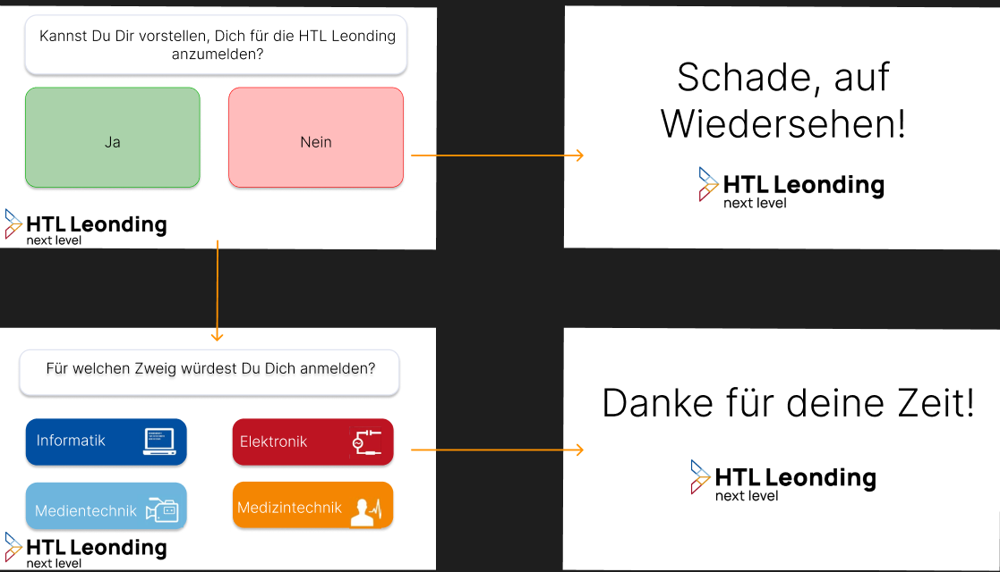

# Project Proposal: Pepper Besucherassistent
----------------------------------------------------
## Projektteam:
- Pühringer Elias
- Schweighofer Diana
- Dworzak Ian

----------------------------------------------------
  
## Ausgangssituation: 
Es gibt keinen Besucherassistenten an der HTL Leonding.
Es gibt für Besucher keine Möglichkeit, sich mittels Lageplan im Schulgebäude zurechtzufinden. 

-----------------------------------------------------

## Vorgaben und Rahmenbedingungen
- Projektarbeit mit SCRUM
- Bereits bestehend ist ein 3D Modell des Schulgebäudes von Prof. Stütz

-----------------------------------------------------

## Zielsetzung
Pepper begrüßt Besucher und kann auf Nachfrage mittels Raumplan die Lehrerzimmer anzeigen.
Am Tag der offenen Tür werden Daten von den Besuchern gesammelt (Plant die Person, die Schule zu besuchen, wenn ja, welcher Zweig)

-----------------------------------------------------

## SWOT Analyse

Stärken:  
- Abheben von Konkurrenz durch Roboter  
- Interesse von potentiellen, zukünftigen Schülern/-innen erwecken  

Gelegenheiten:  
- Lernmöglichkeit für Kotlin/Robotics

Schwächen:  
- schlechte Internetverbindung
- Verständigungsproblem aufgrund von fehlendem Vokabular seitens Pepper
- Kommunikationsproblem aufgrund von Lärmpegel
  
Risiken:
- Kein Interesse an Roboter von Seiten der Besucher/Schule
- Hardwarebeschädigung
- Diebstahl des Roboters

----------------------------------------------------  
  
## Meilensteine

- Pepper Dialog Begüßung fertig
- Pepper Dialog Verabschiedung fertig
- Feedback Speicherung wurde gemacht
- 3D Lageplan der Schule von Prof. Stütz wurde ausgewertet
- Raumausgabe wurde fertiggestellt

----------------------------------------------------  

## Toolstack
  
- Androidstudio
    - Kotlin

----------------------------------------------------  

## User-Stories

Als Besucher möchte ich die Möglichkeit haben mir einen Lageplan der Schule anzusehen, um mich zurecht zu finden.  

Als Besucher möchte ich nur wenig Zeit in Umfragen investieren um so viel von der Schule zu sehen wie möglich.
  
Als AV möchte ich eine Rückmeldung über die Attraktivität der Schule, um Schülerzahlen planen zu können.

## Basic Gui Mockup

